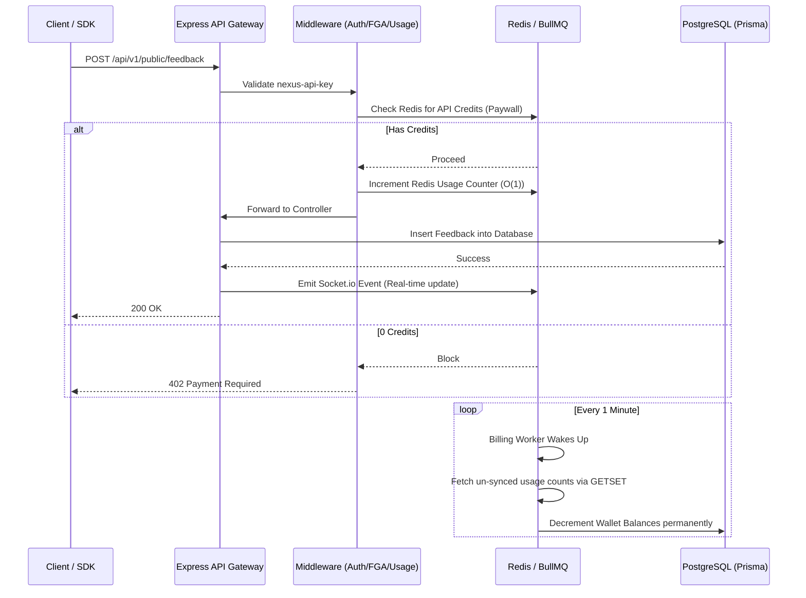

# Nexus API SaaS - Backend Server

Welcome to the backend engine for **Nexus API SaaS**! This is a high-performance, highly scalable Node.js application built with TypeScript and Express. It serves as the core infrastructure for handling multi-tenant feedback boards, API key management, real-time Socket connections, and metered API billing.

## 🌐 Ecosystem Links
- **Admin Dashboard Client (Next.js):** [Nexus API Client GitHub](https://github.com/codewithyuvi/nexus-api-client)
- **Nexus API Portal:** [nexus-api-client.vercel.app](https://nexus-api-client.vercel.app)
- **Live Customer Demo Portal(For Testing):** [nexus-customer.vercel.app](https://nexus-customer.vercel.app/)

## 🚀 What is this project?

The Nexus API SaaS backend is an enterprise-grade Headless API designed to let businesses collect and manage customer feedback. It provides public-facing APIs for developers to integrate into their own applications, while also providing secure administrative APIs for the dashboard.

### Core Technologies
- **Framework:** Express + TypeScript
- **Database:** PostgreSQL (via Prisma ORM)
- **Caching & Rate Limiting:** Redis (Upstash)
- **Background Jobs:** BullMQ (for metered billing sync & audit logging)
- **Authentication:** Clerk
- **Authorization:** OpenFGA (Fine-Grained Authorization for robust RBAC)
- **Real-Time:** Socket.io (with Redis Adapter for multi-node scaling)
- **Payments:** Razorpay

---

## 📂 Folder Structure

```text
server/
├── prisma/
│   └── schema.prisma         # Postgres database schema
├── src/
│   ├── controllers/          # Business logic (billing, dashboard, boards, apikeys)
│   ├── middleware/           # Express middlewares (Clerk Auth, OpenFGA roles, API Usage tracking)
│   ├── routes/               # API route definitions (public vs private/admin)
│   ├── queues/               # BullMQ queue initializations (Audit logs, Billing)
│   ├── workers/              # BullMQ background workers (Redis -> Postgres syncing)
│   ├── utils/                # Singletons and helpers (Prisma, Redis, Razorpay, Socket.io)
│   ├── constants/            # Global constants (Redis Connections)
│   ├── api.ts                # Express App and Middleware chaining setup
│   └── index.ts              # Entry point (Starts HTTP Server and Workers)
├── .env                      # Environment variables
├── package.json
└── tsconfig.json
```

---

## ⚙️ System Flow Architecture

The following diagram illustrates how a typical API request flows through the Nexus backend, demonstrating our highly decoupled and scalable architecture:



---

## 🔧 Setup & Local Development

### 1. Install Dependencies
```bash
npm install
```

### 2. Environment Variables
Create a `.env` file in the root of the `server/` folder and populate it with the required keys (Clerk, Postgres, Redis, OpenFGA, Razorpay). 

### 3. Database Migration & Prisma
Push your schema to the Postgres database and generate the Prisma Client.
```bash
npx prisma db push
npx prisma generate
```

### 4. Start the Server
Run the development server. This uses `tsx` to compile TypeScript on the fly and watch for file changes.
```bash
npm run dev
```
*The server will start on port 5000 and the background workers will immediately begin polling the BullMQ queues.*

---

## 🛡️ Security & Performance Highlights

1. **Lightning Fast Metering:** Public API requests never hit PostgreSQL directly to deduct credits. Usage is securely tracked in memory via Redis and batched into Postgres asynchronously by BullMQ workers to ensure maximum throughput.
2. **OpenFGA Integration:** Strict Role-Based Access Control is enforced at the middleware layer. Admin-only endpoints cannot be accessed without explicit OpenFGA tuple verification.
3. **Bulletproof Transactions:** If a Redis->Postgres batch sync fails, the worker gracefully pushes the uncounted credits back into Redis so no billing data is ever lost during outages.
4. **IPv6 Resilience:** Redis connections explicitly enforce `{ family: 0 }` to guarantee stable connectivity in strict IPv4 containerized environments (like Render).
